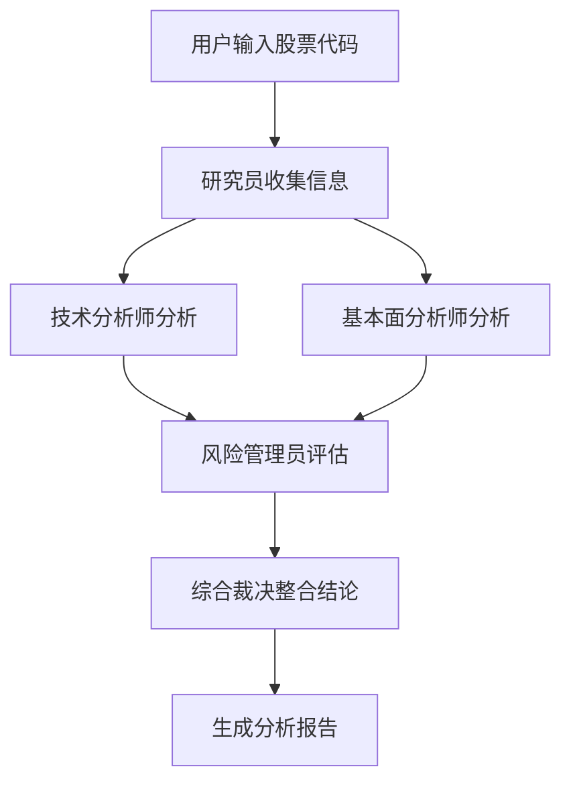

# 多智能体系统详解

**分类**: AI分析股票原理
**难度**: 进阶
**阅读时间**: 15分钟
**更新日期**: 2026-06-05

---

## 📋 引言

AGENTrader采用多智能体协作机制进行股票分析。什么是多智能体系统？为什么要使用多个AI而不是一个？本文将深入解析多智能体系统的原理和优势。

---

## 🤖 什么是多智能体系统？

### 定义

**多智能体系统（Multi-Agent System, MAS）**是由多个智能体（Agent）组成的系统，每个智能体负责特定的任务，通过协作完成复杂的目标。

### 类比理解

想象一个研究团队：

```
传统方式（单智能体）：
一个人负责所有工作
├── 收集数据
├── 技术分析
├── 基本面分析
├── 风险评估
└── 形成研究结论

多智能体方式：
多个专家协作
├── 研究员：收集和整理信息
├── 技术分析师：分析价格走势
├── 基本面分析师：分析财务数据
├── 风险管理员：评估风险
└── 综合裁决：整合结论
```

---

## 🏗️ AGENTrader的智能体架构

### 智能体角色

#### 1. 研究员（Researcher）

**职责**：
- 收集股票基本信息
- 整理财务数据
- 搜集行业资讯
- 汇总市场新闻

**输出示例**：
```markdown
## 股票基本信息
- 代码：000001
- 名称：平安银行
- 行业：银行业
- 上市时间：1991年

## 财务数据
- 市盈率：5.2
- 市净率：0.6
- ROE：10.5%
- 资产负债率：92.5%

## 最新动态
- 2024Q3财报：营收增长8.5%
- 近期新闻：推出数字化转型战略
```

#### 2. 技术分析师（Technical Analyst）

**职责**：
- 分析价格走势
- 计算技术指标
- 识别支撑压力位
- 判断趋势信号

**输出示例**：
```markdown
## 趋势分析
- 短期趋势：震荡
- 中期趋势：上升
- 长期趋势：上升

## 技术指标
- MACD：金叉信号
- RSI：55（中性）
- 均线：站上60日均线

## 关键价位
- 支撑位：11.80元
- 压力位：13.20元
```

#### 3. 基本面分析师（Fundamental Analyst）

**职责**：
- 分析财务指标
- 评估盈利能力
- 研究行业地位
- 判断估值水平

**输出示例**：
```markdown
## 估值分析
- PE 5.2 vs 行业平均 6.5：低估
- PB 0.6：破净，估值吸引力强

## 盈利能力
- ROE 10.5%：中等水平
- 净利润增长率：8.5%：稳健增长

## 行业地位
- 市场份额：前10
- 竞争优势：零售银行业务强
```

#### 4. 风险管理员（Risk Manager）

**职责**：
- 识别风险因素
- 评估风险等级
- 提出风险提示
- 建议风险控制措施

**输出示例**：
```markdown
## 主要风险
1. 信用风险：不良贷款率1.2%
2. 政策风险：金融监管趋严
3. 市场风险：利率波动影响

## 风险等级
- 整体风险：中等
- 风险控制：避免单一结论直接触发交易
- 复核重点：数据时效、行业政策、模型不确定性
```

#### 5. 综合裁决（Portfolio Manager）

**职责**：
- 综合各方意见
- 权衡利弊
- 形成综合研究结论
- 标注适用边界和不确定性

**输出示例**：
```markdown
## 综合评价
基于以上分析，平安银行：
- 估值：★★★★☆（低估）
- 成长性：★★★☆☆（稳健）
- 风险：★★★☆☆（中等）

## 综合结论
- 技术面：短期偏强，但需要成交量确认
- 基本面：估值有吸引力，但盈利弹性有限
- 风险面：金融监管和利率变化需要持续跟踪
- 使用边界：仅作学习参考，不构成投资建议
```

---

## 🔄 协作流程

### 标准分析流程



### 详细步骤

**第1步：信息收集**
```
研究员：
"我已收集到平安银行的基本信息和财务数据，
现在交给技术分析师和基本面分析师进行分析。"
```

**第2步：并行分析**
```
技术分析师：
"从技术面看，股价处于上升通道，MACD金叉..."

基本面分析师：
"从基本面看，PE 5.2低于行业平均，估值有吸引力..."
```

**第3步：风险评估**
```
风险管理员：
"综合技术面和基本面，主要风险包括：
1. 不良贷款率偏高
2. 利率波动风险
需要继续复核数据时效和行业政策变化。"
```

**第4步：综合结论**
```
综合裁决：
"综合各位专家的意见：
- 技术面：积极信号
- 基本面：估值低估
- 风险：可控
最终输出：形成研究结论，并标注关键假设、风险点和复核事项"
```

---

## 🎯 多智能体的优势

### 1. 专业分工

**单智能体**：
```
一个AI处理所有任务
→ 可能在某些方面不够专业
→ 难以深入分析
```

**多智能体**：
```
每个AI专注于特定领域
→ 更专业的分析
→ 更深入的洞察
```

### 2. 多角度分析

**单智能体**：
```
可能存在单一视角的局限
```

**多智能体**：
```
技术面 + 基本面 + 风险评估
→ 更全面的分析
→ 减少盲点
```

### 3. 互相制衡

**示例**：
```
技术分析师："技术面出现积极信号"
↓
风险管理员："但风险较高，需要补充复核条件"
↓
综合裁决："综合考虑，结论需附带风险边界和数据复核要求"
```

### 4. 提高可复核性

多智能体并不天然保证更准确。它的价值在于把不同视角拆开，让每个结论都能追溯到数据、假设和推理过程，降低单一模型一次性输出造成的盲点。

---

## 🗣️ 辩论机制

### 什么是辩论机制？

让不同观点的智能体进行辩论，通过思想碰撞得出更可靠的结论。

### 辩论流程

**场景：分析平安银行的研究结论是否充分**

**第1轮：初始观点**
```
乐观派（基本面分析师）：
"PE 5.2，估值偏低，可以作为进一步研究线索"

谨慎派（风险管理员）：
"不良贷款率1.2%偏高，建议观望"
```

**第2轮：反驳与论证**
```
乐观派：
"虽然不良贷款率1.2%，但在行业内属于中等水平，
且公司拨备覆盖率200%，风险可控。
更重要的是，PE 5.2远低于历史平均7.5，
存在明显的估值修复空间。"

谨慎派：
"估值低有其原因，银行业整体面临净息差收窄压力，
盈利增长放缓。即使PE低，也不代表一定会上涨。
建议等待更明确的催化剂。"
```

**第3轮：达成共识**
```
综合裁决：
"双方观点都有道理。综合考虑：
1. 估值确实有吸引力（乐观派正确）
2. 风险需要重视（谨慎派正确）

最终输出：
- 当前结论偏积极，但必须保留风险前提
- 需要继续关注净息差、不良率和季度财报
- 报告仅供学习参考，不构成投资建议"
```

---

## 💡 实现原理

### 提示词设计

**研究员提示词**：
```
你是一位专业的股票研究员，负责收集和整理股票信息。

任务：收集{股票代码}的基本信息
包括：
1. 公司基本情况
2. 财务数据
3. 行业信息
4. 最新动态

要求：
- 数据准确
- 信息全面
- 格式清晰
```

**技术分析师提示词**：
```
你是一位技术分析专家，专注于价格走势和技术指标。

基于以下数据分析{股票代码}：
{价格数据}
{技术指标}

请分析：
1. 趋势判断
2. 技术指标信号
3. 支撑压力位
4. 趋势信号和风险提示
```

### 信息传递

```python
# 伪代码示例
class MultiAgentSystem:
    def analyze(self, stock_code):
        # 第1步：研究员收集信息
        info = researcher.collect(stock_code)

        # 第2步：并行分析
        technical = technical_analyst.analyze(info)
        fundamental = fundamental_analyst.analyze(info)

        # 第3步：风险评估
        risk = risk_manager.assess(technical, fundamental)

        # 第4步：综合结论
        conclusion = portfolio_manager.summarize(
            technical, fundamental, risk
        )

        return conclusion
```

---

## 📊 效果对比

### 测试案例：分析平安银行

**单智能体分析**：
```
分析深度：★★★☆☆
分析角度：★★☆☆☆
风险提示：★★☆☆☆
可复核性：★★★☆☆
```

**多智能体分析**：
```
分析深度：★★★★★
分析角度：★★★★★
风险提示：★★★★☆
可复核性：★★★★★
```

---

## 📚 总结

### 核心要点

1. **多智能体系统**由多个专业AI协作完成任务
2. **AGENTrader**包含5个核心智能体角色
3. **协作流程**：收集→分析→评估→整合
4. **主要优势**：专业分工、多角度、互相制衡
5. **辩论机制**提高结论的可解释性和可复核性

### 实践建议

1. **理解每个智能体的职责**
2. **关注智能体之间的互动**
3. **重视不同观点的碰撞**
4. **综合考虑各方意见**

---

## 🔗 相关资源

- 📖 [AGENTrader架构介绍](../06-resources/agentrader_intro.md)
- 📖 [快速开始](../../overview/quick-start.md)
